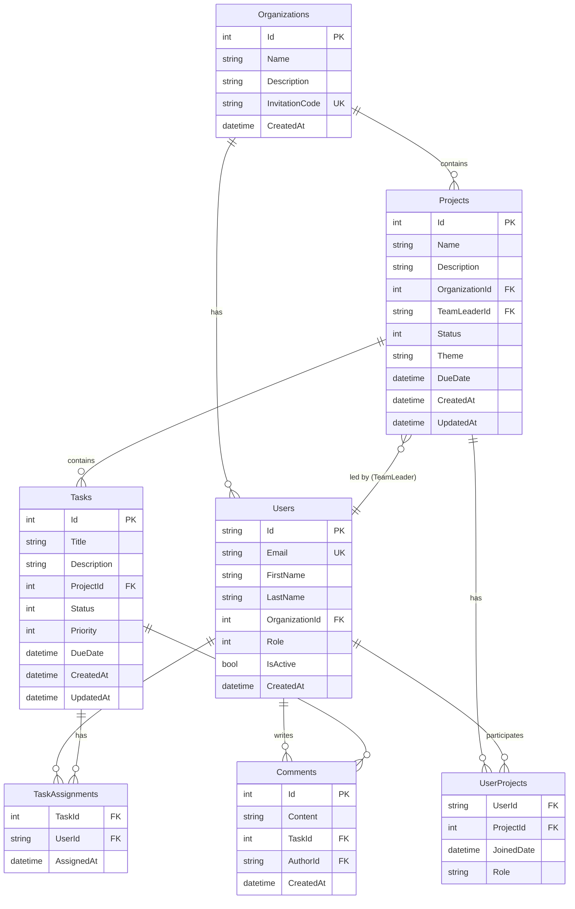

# TeamFlow - Project Management System

## Opis Systemu

TeamFlow to kompleksowa aplikacja webowa do zarządzania projektami i zadaniami w zespołach. System umożliwia organizacjom tworzenie projektów, przypisywanie zadań członkom zespołu, śledzenie postępów oraz współpracę poprzez komentarze.

### Główne Funkcjonalności

- **Zarządzanie Organizacjami**: Tworzenie organizacji z unikalnym kodem zaproszenia
- **Zarządzanie Projektami**: Tworzenie projektów z przypisanymi liderami i członkami zespołu
- **Zarządzanie Zadaniami**: Pełny cykl życia zadań (ToDo → InProgress → Done) z priorytetami i terminami
- **System Ról**: Administrator, Team Leader, Member z różnymi uprawnieniami
- **Komentarze**: Komunikacja w kontekście zadań
- **Autoryzacja**: Bezpieczne logowanie i zarządzanie sesjami użytkowników

### Użytkownicy Systemu

- **Administrator**: Pełne uprawnienia w organizacji, zarządzanie wszystkimi projektami i użytkownikami
- **Team Leader**: Zarządzanie projektami, tworzenie i edycja zadań
- **Member**: Przeglądanie projektów, zmiana statusu przypisanych zadań, dodawanie komentarzy

## Diagram ERD



## Struktura Bazy Danych

### Tabele

#### Organizations
- **Klucz główny**: Id (INT, AUTOINCREMENT)
- **Klucze unikalne**: InvitationCode
- **Indeksy**: InvitationCode (UNIQUE)

#### AspNetUsers (Users)
- **Klucz główny**: Id (STRING)
- **Klucze obce**: OrganizationId → Organizations(Id)
- **Indeksy**: OrganizationId, Role, Email (UNIQUE)

#### Projects
- **Klucz główny**: Id (INT, AUTOINCREMENT)
- **Klucze obce**: 
  - OrganizationId → Organizations(Id) CASCADE
  - TeamLeaderId → AspNetUsers(Id) SET NULL
- **Indeksy**: OrganizationId, TeamLeaderId, Status

#### Tasks
- **Klucz główny**: Id (INT, AUTOINCREMENT)
- **Klucze obce**: ProjectId → Projects(Id) CASCADE
- **Indeksy**: ProjectId, Status, Priority, DueDate

#### UserProjects (N:M)
- **Klucz główny**: (UserId, ProjectId)
- **Klucze obce**:
  - UserId → AspNetUsers(Id)
  - ProjectId → Projects(Id) CASCADE
- **Indeksy**: UserId, ProjectId

#### TaskAssignments (N:M)
- **Klucz główny**: (TaskId, UserId)
- **Klucze obce**:
  - TaskId → Tasks(Id) CASCADE
  - UserId → AspNetUsers(Id) CASCADE
- **Indeksy**: TaskId, UserId

#### Comments
- **Klucz główny**: Id (INT, AUTOINCREMENT)
- **Klucze obce**:
  - TaskId → Tasks(Id) CASCADE
  - AuthorId → AspNetUsers(Id) RESTRICT
- **Indeksy**: TaskId, AuthorId

### Relacje

- **1:N**: Organization → Projects, Organization → Users, Project → Tasks
- **N:M**: Users ↔ Projects (via UserProjects), Users ↔ Tasks (via TaskAssignments)

## Procedury Składowane, Funkcje i Wyzwalacze

> **Uwaga**: Projekt używa SQLite, która nie wspiera procedur składowanych i funkcji T-SQL. Poniżej przedstawiono implementację w T-SQL (dla dokumentacji) oraz rzeczywiste triggery SQLite.

### Procedury Składowane (T-SQL)

#### 1. GetProjectProgress
**Opis**: Oblicza procent ukończonych zadań dla danego projektu.

**Parametry**:
- `@ProjectId INT` - ID projektu

**Zwraca**: Procent ukończenia (0-100)

**Lokalizacja**: `backend/TeamFlow.Infrastructure/Database/Procedures.sql`

#### 2. GetUserTaskStats
**Opis**: Zwraca statystyki zadań użytkownika pogrupowane według statusu.

**Parametry**:
- `@UserId NVARCHAR(450)` - ID użytkownika

**Zwraca**: Tabela z kolumnami (Status, TaskCount)

**Lokalizacja**: `backend/TeamFlow.Infrastructure/Database/Procedures.sql`

### Funkcje Użytkownika (T-SQL)

#### 1. CalculateTaskDuration
**Opis**: Oblicza czas trwania zadania w dniach (od utworzenia do ukończenia lub do teraz).

**Parametry**:
- `@TaskId INT` - ID zadania

**Zwraca**: INT - liczba dni

**Logika**: 
- Jeśli zadanie jest ukończone (Status = Done) i ma UpdatedAt, używa UpdatedAt jako daty zakończenia
- W przeciwnym razie używa bieżącej daty

**Lokalizacja**: `backend/TeamFlow.Infrastructure/Database/Functions.sql`

### Wyzwalacze (SQLite)

#### 1. UpdateProjectLastActivity_Insert
**Opis**: Aktualizuje pole `UpdatedAt` w tabeli Projects po dodaniu nowego zadania.

**Zdarzenie**: AFTER INSERT ON Tasks

**Akcja**: UPDATE Projects SET UpdatedAt = DATETIME('now') WHERE Id = NEW.ProjectId

#### 2. UpdateProjectLastActivity_Update
**Opis**: Aktualizuje pole `UpdatedAt` w tabeli Projects po modyfikacji zadania.

**Zdarzenie**: AFTER UPDATE ON Tasks

**Akcja**: UPDATE Projects SET UpdatedAt = DATETIME('now') WHERE Id = NEW.ProjectId

#### 3. UpdateProjectLastActivity_Delete
**Opis**: Aktualizuje pole `UpdatedAt` w tabeli Projects po usunięciu zadania.

**Zdarzenie**: AFTER DELETE ON Tasks

**Akcja**: UPDATE Projects SET UpdatedAt = DATETIME('now') WHERE Id = OLD.ProjectId

**Lokalizacja**: 
- SQL: `backend/TeamFlow.Infrastructure/Database/Triggers.sql`
- Migracja: `backend/TeamFlow.Infrastructure/Migrations/20251201120910_AddTriggers.cs`

## Technologie

### Backend
- **Framework**: ASP.NET Core 9.0
- **Architektura**: Web API (RESTful)
- **ORM**: Entity Framework Core 9.0 (Code First)
- **Baza danych**: SQLite
- **Autoryzacja**: ASP.NET Core Identity + Cookie Authentication
- **Walidacja**: Data Annotations + ModelState
- **Testy**: xUnit + Moq + InMemory Database

### Frontend
- **Framework**: React 18
- **Build Tool**: Vite
- **Język**: TypeScript
- **Routing**: React Router
- **Styling**: CSS (Custom)
- **Animacje**: Framer Motion
- **HTTP Client**: Axios

### Struktura Projektu

```
backend/
├── TeamFlow.API/           # Web API Controllers, DTOs, Middleware
├── TeamFlow.Domain/        # Entities, Enums
├── TeamFlow.Infrastructure/# DbContext, Migrations, Identity
└── TeamFlow.Tests/         # Unit Tests

frontend/
├── components/             # React Components
├── api/                    # API Service Layer
├── contexts/               # React Contexts
└── hooks/                  # Custom React Hooks
```

## Instrukcja Uruchomienia

### Wymagania
- .NET SDK 9.0 lub nowszy
- Node.js 18+ i npm
- Git

### Krok 1: Sklonowanie Repozytorium
```bash
git clone <repository-url>
cd frontendnew
```

### Krok 2: Uruchomienie Backendu

```bash
# Przejdź do katalogu backendu
cd backend/TeamFlow.API

# Przywróć pakiety NuGet
dotnet restore

# Zastosuj migracje do bazy danych
dotnet ef database update --project ../TeamFlow.Infrastructure/TeamFlow.Infrastructure.csproj

# Uruchom aplikację
dotnet run
```

Backend będzie dostępny pod adresem: `http://localhost:5000` 

### Krok 3: Uruchomienie Frontendu

```bash
# W nowym terminalu, przejdź do katalogu głównego
cd frontendnew

# Zainstaluj zależności
npm install

# Uruchom serwer deweloperski
npm run dev
```

Frontend będzie dostępny pod adresem: `http://localhost:5173`

### Krok 4: Uruchomienie Testów

```bash
# W katalogu głównym
cd backend
dotnet test
```

## Dane Testowe

Po pierwszym uruchomieniu możesz:
1. Zarejestrować nowe konto
2. Utworzyć organizację (otrzymasz kod zaproszenia)
3. Zaprosić innych użytkowników używając kodu
4. Utworzyć projekty i zadania

Lub zalogowac sie do gotowych kont
1. admin@acme.com
2. manager1@acme.com
3. manager2@acme.com
4. dev1@acme.com - dev8@acme.com
   Wszyscy mają hasło: Password123!

## API Endpoints

### Autoryzacja
- `POST /api/auth/register` - Rejestracja użytkownika
- `POST /api/auth/login` - Logowanie
- `POST /api/auth/logout` - Wylogowanie
- `GET /api/auth/me` - Pobranie danych zalogowanego użytkownika

### Projekty
- `GET /api/projects` - Lista projektów
- `GET /api/projects/{id}` - Szczegóły projektu
- `POST /api/projects` - Utworzenie projektu
- `PUT /api/projects/{id}` - Aktualizacja projektu
- `DELETE /api/projects/{id}` - Usunięcie projektu

### Zadania
- `GET /api/tasks` - Lista zadań (z filtrowaniem)
- `GET /api/tasks/{id}` - Szczegóły zadania
- `POST /api/tasks` - Utworzenie zadania
- `PUT /api/tasks/{id}` - Aktualizacja zadania
- `PATCH /api/tasks/{id}/status` - Zmiana statusu zadania
- `DELETE /api/tasks/{id}` - Usunięcie zadania
- `POST /api/tasks/{id}/assignees` - Przypisanie użytkownika
- `DELETE /api/tasks/{id}/assignees/{userId}` - Usunięcie przypisania

### Komentarze
- `GET /api/tasks/{id}/comments` - Lista komentarzy zadania
- `POST /api/tasks/{id}/comments` - Dodanie komentarza
- `DELETE /api/tasks/comments/{id}` - Usunięcie komentarza


